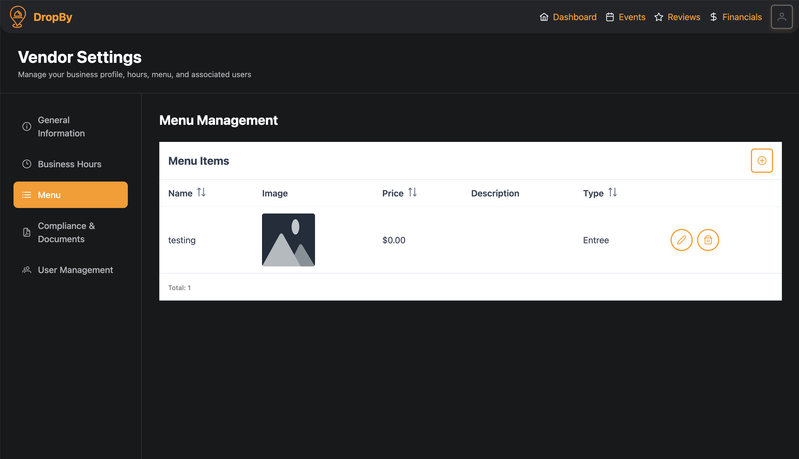

# DropBy

Welcome to the ultimate event platform for food trucks and drinking establishments! Good drinks belong with good eats, and every food truck should have a spot to serve a hungry crowd. With DropBy, businesses can find each other and book events, increasing sales for both, and improving the overall experience for a shared customer base.


## For Businesses

Worry no more about finding a food truck to feed your patrons. Easily schedule events and approve food trucks in the area to work during business.


## For Food Trucks

Need a place to park your vehicle? With our app, you can find available events in your area and work with breweries and other establishments to increase your sales for the evening.




## For Everyone Else

Use our map to follow your favorite food trucks to new locations, or see what food is being served at your local brewery.


---

## Tech Stack

- **Framework:** [Nuxt 3](https://nuxt.com/) (Vue 3, Composition API, TypeScript)
- **UI:** [PrimeVue](https://primevue.org/) + [Tailwind CSS](https://tailwindcss.com/) + [PrimeIcons](https://primevue.org/icons/)
- **State Management:** [Pinia](https://pinia.vuejs.org/)
- **Database & Auth:** [Supabase](https://supabase.com/) (PostgreSQL, Row Level Security, Auth)
- **Payments:** [Stripe](https://stripe.com/) (subscriptions, one-time payments, Connect)
- **Email:** [Resend](https://resend.com/)
- **AI:** [OpenAI](https://openai.com/) (menu item description generation)
- **Maps:** [Google Maps](https://developers.google.com/maps) (Places Autocomplete, map views)
- **Charts:** [Chart.js](https://www.chartjs.org/) via [vue-chartjs](https://vue-chartjs.org/)

## Prerequisites

- [Node.js](https://nodejs.org/) (v18+)
- npm (comes with Node.js)
- A [Supabase](https://supabase.com/) project
- A [Stripe](https://stripe.com/) account (for payments)
- A [Resend](https://resend.com/) account (for transactional email)
- A [Google Cloud](https://console.cloud.google.com/) project with Maps JavaScript API and Places API enabled
- An [OpenAI](https://platform.openai.com/) API key (for AI features)

## Environment Variables

Create a `.env` file in the project root. The following variables are required:

```bash
# Supabase
SUPABASE_URL=              # Your Supabase project URL
SUPABASE_KEY=              # Supabase anon/public key
SUPABASE_SERVICE=          # Supabase service role key

# Stripe
STRIPE_SECRET_KEY=         # Stripe secret key
STRIPE_PUBLISHABLE_KEY=    # Stripe publishable key
STRIPE_WEBHOOK_SECRET=     # Stripe webhook endpoint secret

# Resend (email)
RESEND_API_KEY=            # Resend API key

# Google Maps
GMAPS_API_KEY=             # Google Maps JavaScript API key
GEO_KEY=                   # Google Places Autocomplete key

# OpenAI
OPENAI_API_KEY=            # OpenAI API key

# App
NUXT_PUBLIC_SITE_URL=      # Public site URL (defaults to https://dropby.dev)
NUXT_PUBLIC_APP_ENV=       # development | staging | production
SUPERADMIN_EMAIL=          # Email address for the superadmin user

# Cron jobs
CRON_SECRET=               # Secret token to authenticate cron job requests
```

## Setup

Install dependencies:

```bash
npm install
```

This will also run `nuxt prepare` as a postinstall step to generate the `.nuxt` directory.

## Development

Start the development server on `http://localhost:3000`:

```bash
npm run dev
```

### Additional Scripts

| Script | Description |
|---|---|
| `npm run dev` | Start dev server (local env) |
| `npm run dev:prod` | Start dev server with production `.env` |
| `npm run build` | Build for production |
| `npm run build:staging` | Build for staging environment |
| `npm run build:prod` | Build for production environment |
| `npm run preview` | Preview production build locally |
| `npm run generate` | Generate static site |
| `npm run supabase:create-buckets` | Create Supabase storage buckets (local env) |
| `npm run supabase:create-buckets:prod` | Create Supabase storage buckets (production env) |

## Production

Build the application for production:

```bash
npm run build
```

Locally preview the production build:

```bash
npm run preview
```

---

## Project Structure

```
dropby/
├── assets/              # Static assets, styles, and themes
│   ├── styles/          # Global CSS (base.css)
│   ├── themes/          # PrimeVue custom theme (dropby-theme.ts)
│   └── readme/          # README screenshots
├── components/          # Vue components organized by feature
│   ├── admin/           # Superadmin panel components
│   ├── event/           # Event creation, editing, calendar, and cards
│   ├── menu/            # Menu item CRUD and table views
│   ├── merchant/        # Merchant list and settings
│   ├── settings/        # Payment methods and notification settings
│   ├── skeleton/        # Loading skeleton components
│   ├── subscription/    # Subscription payment modal
│   └── vendor/          # Vendor cards, settings, and Stripe Connect
├── composables/         # Vue composables (store facades and shared logic)
├── constants/           # App-wide constants and config values
├── layouts/             # Nuxt layouts (default layout with header/nav)
├── middleware/           # Nuxt route middleware (auth guards)
├── pages/               # File-based routing (Nuxt pages)
├── scripts/             # SQL migration scripts
├── server/              # Nitro server (API routes and utilities)
│   ├── api/             # API endpoints organized by resource
│   └── utils/           # Server-side utility functions
├── services/            # API service layer (typed fetch wrappers)
│   └── api/             # Domain-specific API services
├── stores/              # Pinia state management stores
├── types/               # Shared TypeScript type definitions
├── utils/               # Client-side utility functions
├── app.vue              # Root app component
├── nuxt.config.ts       # Nuxt configuration
└── package.json         # Dependencies and scripts
```

### Pages

Routes are auto-generated from the `pages/` directory:

| Path | Description |
|---|---|
| `/` | Landing page / public event map |
| `/login` | User login |
| `/get-started` | New user onboarding |
| `/forgot-password` | Password reset request |
| `/reset-password` | Password reset form |
| `/admin` | Superadmin panel (users, merchants, vendors, beta testers) |
| `/feedback` | User feedback board |
| `/settings/[id]` | User account settings |
| `/messages/[id]` | Messaging |
| `/merchant/[id]/dashboard` | Merchant dashboard |
| `/merchant/[id]/events` | Merchant events management |
| `/merchant/[id]/recurring-events` | Recurring event management |
| `/merchant/[id]/analytics` | Merchant analytics |
| `/merchant/[id]/profile` | Merchant profile |
| `/merchant/[id]/ratings-and-reviews` | Merchant reviews |
| `/vendor/[id]/dashboard` | Vendor dashboard |
| `/vendor/[id]/events` | Vendor events |
| `/vendor/[id]/analytics` | Vendor analytics |
| `/vendor/[id]/profile` | Vendor profile |
| `/vendor/[id]/ratings-and-reviews` | Vendor reviews |
| `/viewer/events` | Public events view |
| `/viewer/establishments-list` | Browse establishments |
| `/viewer/food-trucks-list` | Browse food trucks |
| `/viewer/about` | About page |
| `/event-invite/[token]` | Event invitation acceptance |
| `/subscription/success` | Subscription confirmation |

### Composables

Composables in `composables/` wrap Pinia stores and provide clean APIs for components. Components consume composables rather than stores directly.

| Composable | Purpose |
|---|---|
| `useAdmin` | Admin panel data (merchants, vendors, users) |
| `useApi` | Centralized API client with error handling |
| `useAuth` | Authentication state, login/logout, role checks |
| `useEnvironment` | Environment detection (dev/staging/production) |
| `useFeedback` | Feedback board state and actions |
| `useGooglePlacesAutocomplete` | Google Maps Places Autocomplete integration |
| `useMenu` | Menu item CRUD and AI description generation |
| `useNotificationPreferences` | Notification preference management |
| `useNotificationTypes` | Notification type icons and labels |
| `useSubscription` | Subscription creation and management |
| `useTheme` | Light/dark mode switching |
| `useTimelineIcons` | Timeline item icon and color mapping |
| `useToast` | Toast notification wrapper (PrimeVue) |

### Stores

Pinia stores in `stores/` manage canonical application state. Data flows: **store → composable → component**.

| Store | Purpose |
|---|---|
| `business-hours` | Business operating hours |
| `compliance` | Compliance document uploads and expiry tracking |
| `event` | Event CRUD, timeline, and usage tracking |
| `feedback` | User feedback items and voting |
| `menu` | Menu item management |
| `merchant` | Merchant profiles and analytics |
| `notification` | In-app notifications |
| `payment` | Payment history and processing |
| `recurring-event` | Recurring event scheduling |
| `review` | Ratings and reviews |
| `storage` | Supabase file storage (images, documents) |
| `subscription` | Subscription plans and feature access |
| `timeline` | Activity timeline items |
| `user` | User profile, roles, and preferences |
| `vendor` | Vendor profiles and analytics |

### Utilities

Client-side helpers in `utils/`:

| Utility | Purpose |
|---|---|
| `analytics` | Event metrics, growth calculations, and aggregations |
| `dates` | Date/period helpers for analytics and time-based calculations |
| `events` | Event-related helper functions |
| `menuItemPlan` | Sanitize menu items based on subscription plan |
| `timeSeries` | Time series generation for chart data |

### Services

API service layer in `services/api/` providing typed fetch wrappers around server endpoints:

| Service | Purpose |
|---|---|
| `notificationService` | Email notification dispatch (booking, review, event requests) |
| `paymentService` | Payment method and payment intent operations |
| `subscriptionService` | Subscription creation and cancellation |
| `usageService` | Feature usage tracking and limit checks |
| `vendorService` | Vendor Stripe Connect status and onboarding |

### Server API Endpoints

Server routes live under `server/api/` organized by resource. Each HTTP method gets its own file (e.g., `[id].delete.ts`, `[id].patch.ts`).

| Resource | Endpoints | Description |
|---|---|---|
| `/api/beta-testers` | `GET`, `POST`, `DELETE` | Beta tester management |
| `/api/beta/check` | `GET` | Check beta tester status |
| `/api/cron/*` | `POST` | Scheduled jobs (event reminders, recurring events, completed events) |
| `/api/event-invites` | `GET`, `POST` | Event invitation via token-based links |
| `/api/feedback` | `GET`, `POST`, `PATCH`, `DELETE` | Feedback board CRUD |
| `/api/feedback/[id]/vote` | `POST` | Feedback voting |
| `/api/notification-preferences` | `PATCH` | Update notification preferences |
| `/api/onboarding/create-account` | `POST` | New account creation |
| `/api/payments/*` | Various | Payment intents, methods, webhooks |
| `/api/stripe/customer/create` | `POST` | Stripe customer creation |
| `/api/subscriptions/*` | `POST` | Subscription create/cancel |
| `/api/usage/*` | `GET`, `POST` | Feature usage check and increment |
| `/api/vendors/*` | `GET`, `POST` | Vendor Stripe Connect setup and status |
| `/api/addUser` | `POST` | Add a user |
| `/api/delete-user` | `POST` | Delete a user |
| `/api/invite-user` | `POST` | Send user invitation email |
| `/api/generateMenuItemDescription` | `POST` | AI-powered menu description generation |
| `/api/sendBookingConfirmation` | `POST` | Booking confirmation email |
| `/api/sendEventRequestNotification` | `POST` | Event request notification email |
| `/api/sendReviewNotification` | `POST` | Review notification email |

### Server Utilities

Shared server-side helpers in `server/utils/`:

| Utility | Purpose |
|---|---|
| `isBetaTester` | Check if a user is a beta tester |
| `notificationPreferences` | Notification preference helpers |
| `requireSuperadmin` | Authorization guard for superadmin-only routes |
| `stripePlanPrices` | Stripe plan/price ID mapping |
| `superadmin` | Superadmin identification helpers |

### Middleware

Route middleware in `middleware/` for client-side auth guards:

| Middleware | Purpose |
|---|---|
| `auth` | Requires authenticated user |
| `superadmin` | Requires superadmin role |

Middleware is stacked via `definePageMeta`, e.g., `middleware: ['auth', 'superadmin']`.

### Constants

App-wide configuration in `constants/`:

| File | Purpose |
|---|---|
| `notificationTypes` | Notification action types, icons, and labels |
| `stripePlanPriceIds` | Stripe price IDs for subscription tiers |
| `subscriptionFeatures` | Feature access definitions per plan |
| `subscriptionPlans` | Subscription plan metadata and pricing |

### Types

Shared TypeScript types in `types/`:

| File | Purpose |
|---|---|
| `index.ts` | Domain types (User, Merchant, Vendor, Event, MenuItem, etc.) |
| `api.ts` | API error types and response transformers |

### SQL Migrations

Database migration scripts in `scripts/`:

| Script | Purpose |
|---|---|
| `add-notification-preferences-column.sql` | Add notification preferences to users |
| `create-event-invites-table.sql` | Event invites table schema |
| `create-event-reminders-table.sql` | Event reminders table schema |

---

## Architecture

### Data Flow

```
Component → Composable → Pinia Store → Supabase (DB)
                                      → Services → Server API
```

- **Components** call composables for state and actions
- **Composables** wrap Pinia stores, exposing state as `computed` refs
- **Stores** own canonical state and orchestrate API calls
- **Services** provide typed wrappers around server API endpoints
- **Server API routes** interact with Supabase, Stripe, Resend, and OpenAI

### Authorization

Authorization is enforced at two layers:

1. **Client-side:** Nuxt route middleware (`auth`, `superadmin`) guards pages
2. **Server-side:** Utility functions (`requireSuperadmin`) protect API routes with HTTP 401/403 errors

### Key Patterns

- **Store → Composable → Component:** Components never access stores directly
- **Fire-and-forget side effects:** Email notifications are sent after the primary action succeeds, wrapped in separate try/catch blocks
- **Parallel data loading:** Independent API calls use `Promise.all` with individual `.catch()` handlers
- **Lazy tab loading:** Tab-based UIs only fetch data when the user navigates to a tab
- **Slot-based composition:** Reusable card components use named slots for flexible content
