# DropBy

Welcome to the ultimate event platform for food trucks and drinking establishments. Good drinks belong with good eats, and every food truck should have a spot to serve a hungry crowd. With DropBy, establishments and food trucks find each other, book events, and grow together—while patrons discover where to go.

**Establishments** schedule slots and approve food trucks. **Food trucks** discover events and request bookings. **Everyone else** browses events, maps, and details. The gallery below is ordered by the core product journey so visitors quickly see what DropBy does best.

---

## Screenshots

### 1. Landing

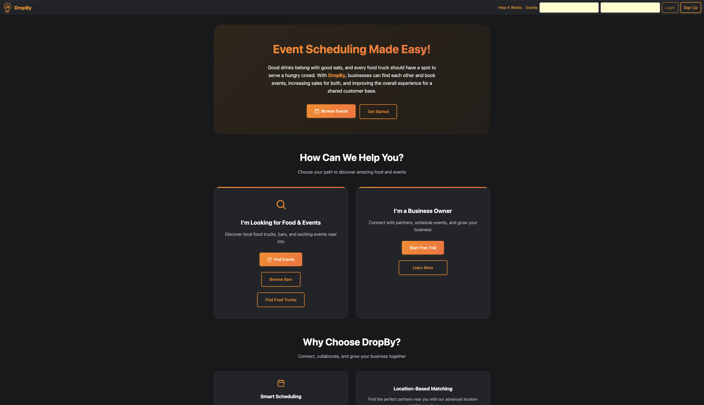

### 2. Establishment dashboard

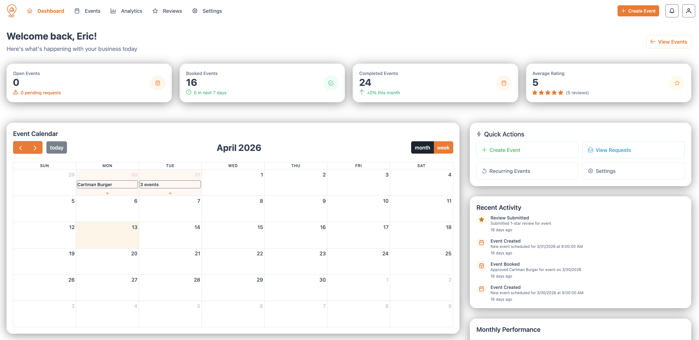

### 3. Food truck dashboard

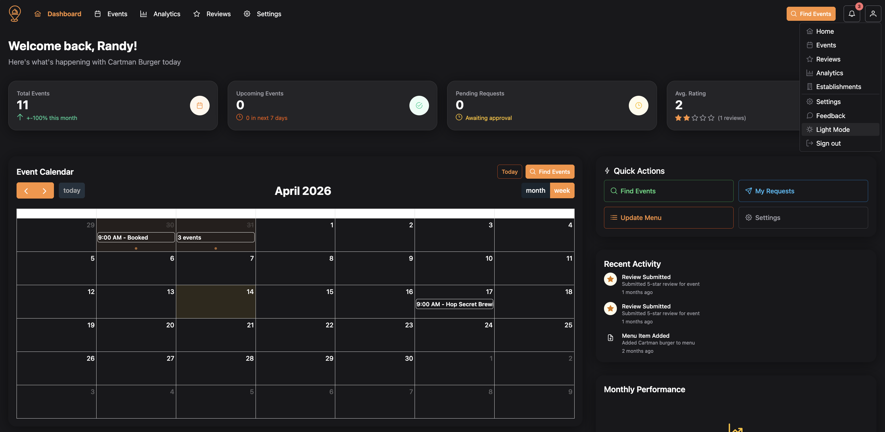

### 4. Event discovery and filters

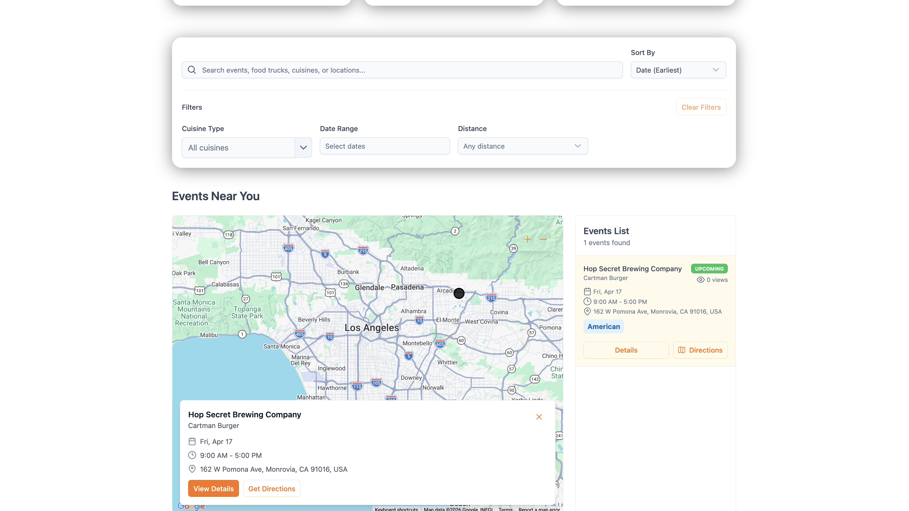

### 5. Event details

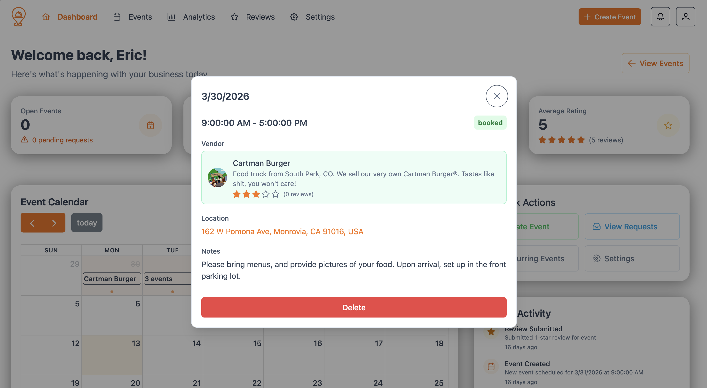

### 6. Request an event (food truck)

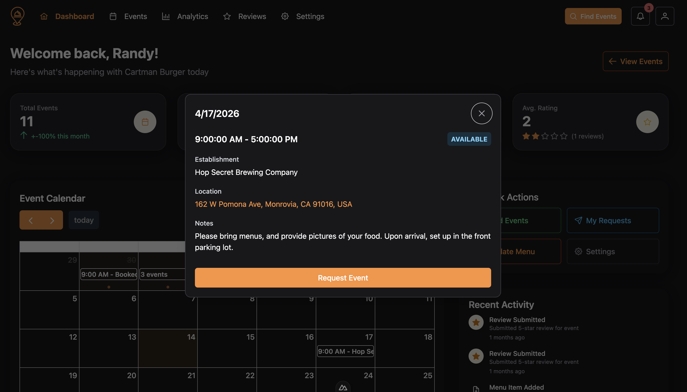

### 7. Approve or reject requests (establishment)

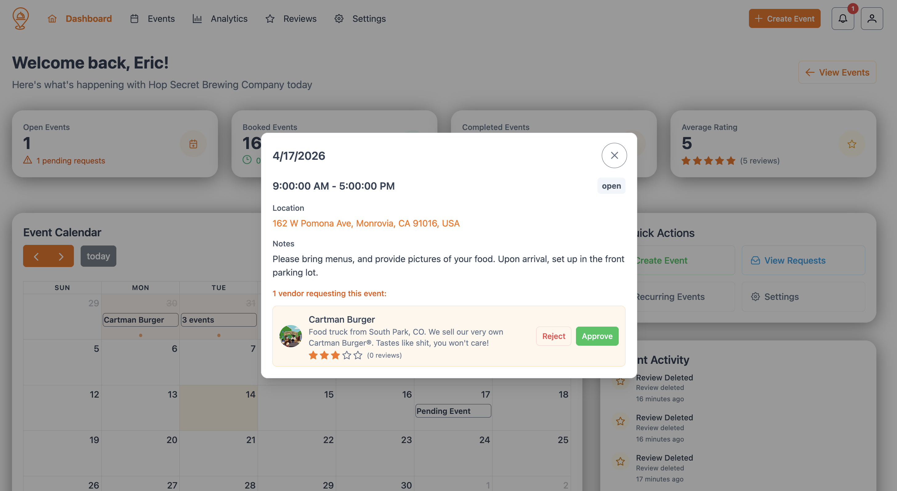

### 8. Create an event (establishment)

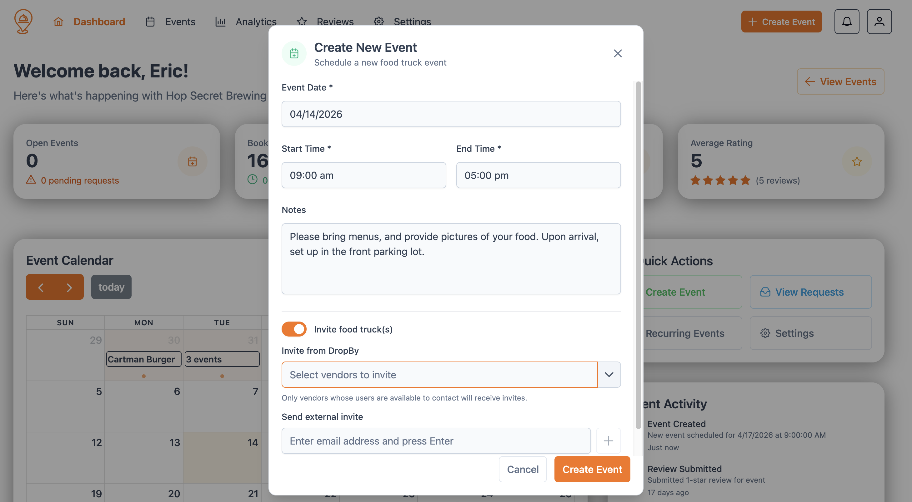

### 9. Recurring events

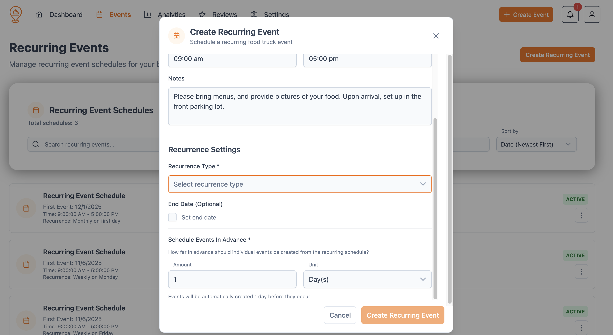

### 10. Settings and profile

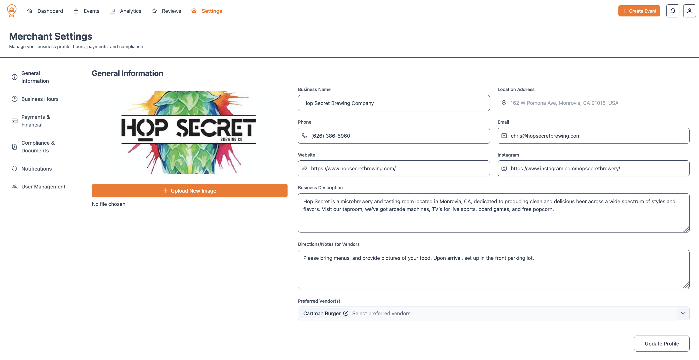

### 11. Billing and subscription management

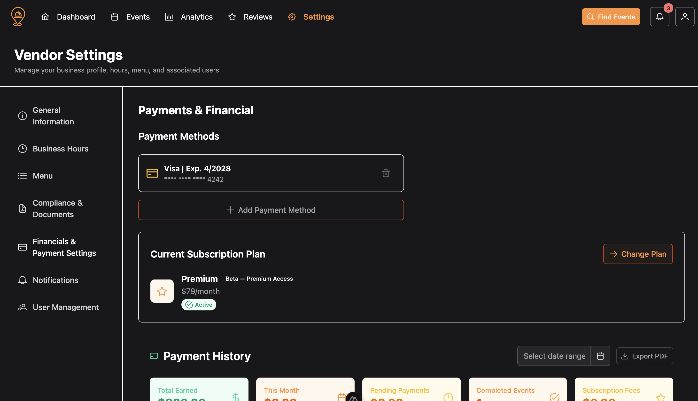

### 12. Establishment analytics

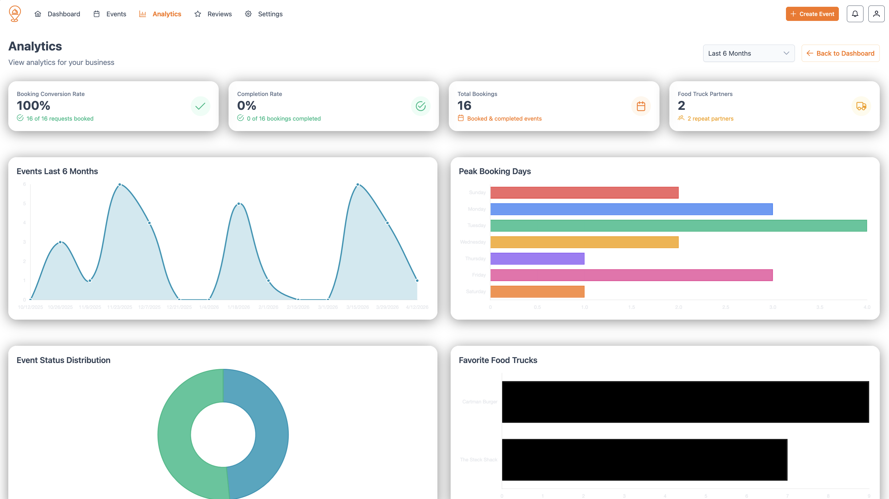

### 13. Ratings and reviews

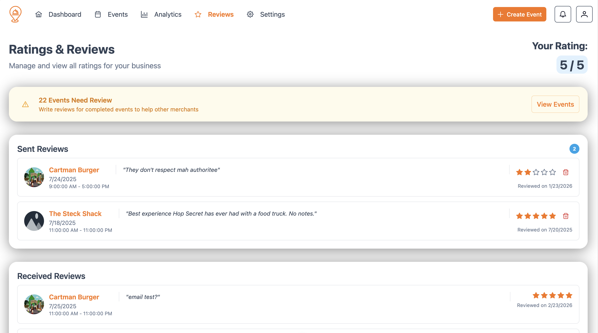

### 14. Food truck menu management

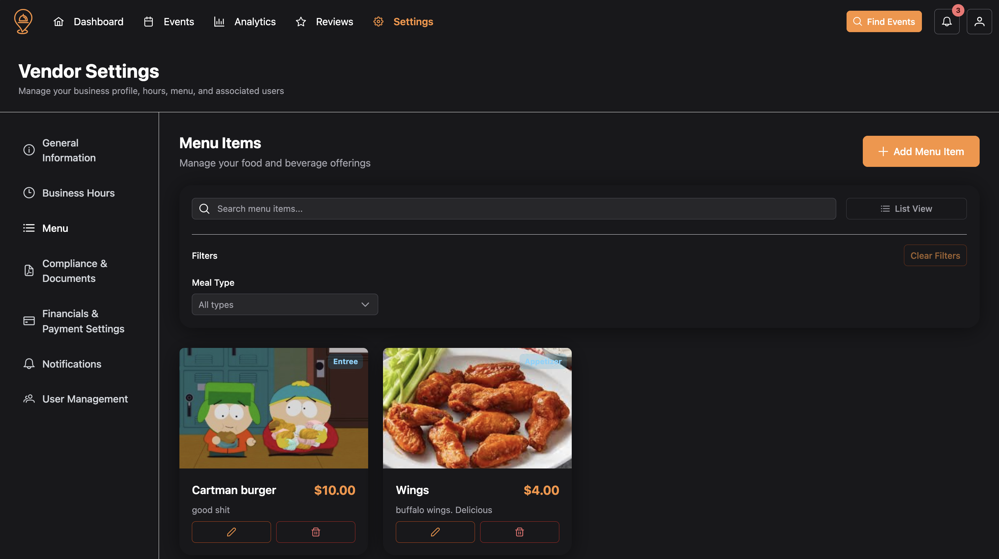

### 15. Add menu item workflow

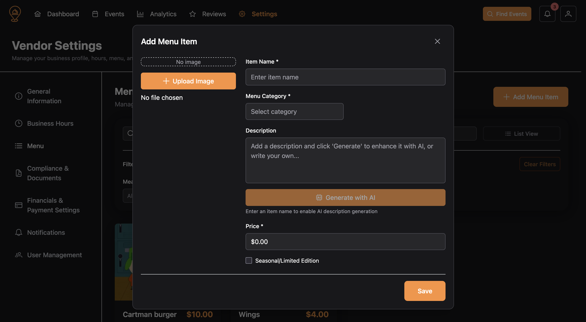

---

## Setup

Make sure to install the dependencies:

```bash
# npm
npm install

# pnpm
pnpm install

# yarn
yarn install

# bun
bun install
```

## Development Server

Start the development server on `http://localhost:3000`:

```bash
# npm
npm run dev

# pnpm
pnpm run dev

# yarn
yarn dev

# bun
bun run dev
```

## Production

Build the application for production:

```bash
# npm
npm run build

# pnpm
pnpm run build

# yarn
yarn build

# bun
bun run build
```

Locally preview production build:

```bash
# npm
npm run preview

# pnpm
pnpm run preview

# yarn
yarn preview

# bun
bun run preview
```
