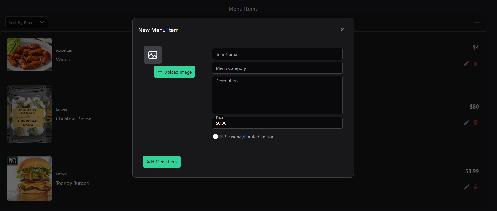
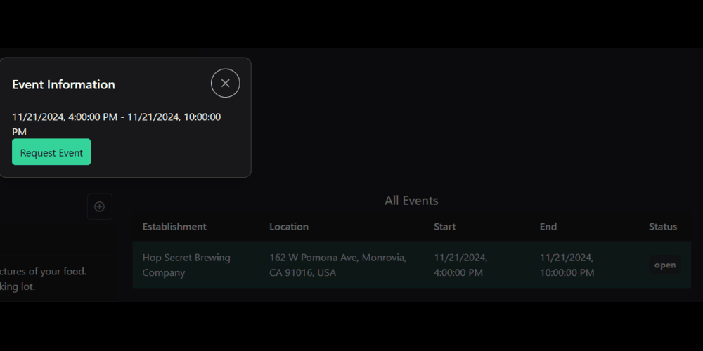

# DropBy

Welcome to the ultimate event platform for food trucks and drinking establishments! Good drinks belong with good eats, and every food truck should have a spot to serve a hungry crowd. With DropBy, businesses can find each other and book events, increasing sales for both, and improving the overall experience for a shared customer base.


## For Businesses
Worry no more about finding a food truck to feed your patrons. Easily schedule events and approve food trucks in the area to work during business.


## For Food Trucks
Need a place to park your vehicle? With our app, you can find available events in your area and work with breweries and other establishments to increase your sales for the evening.







## For Everyone Else
Use our map to follow your favorite food trucks to new locations, or see what food is being served at your local brewery.


## Setup

Make sure to install the dependencies:

```bash
# npm
npm install

# pnpm
pnpm install

# yarn
yarn install

# bun
bun install
```

## Development Server

Start the development server on `http://localhost:3000`:

```bash
# npm
npm run dev

# pnpm
pnpm run dev

# yarn
yarn dev

# bun
bun run dev
```

## Production

Build the application for production:

```bash
# npm
npm run build

# pnpm
pnpm run build

# yarn
yarn build

# bun
bun run build
```

Locally preview production build:

```bash
# npm
npm run preview

# pnpm
pnpm run preview

# yarn
yarn preview

# bun
bun run preview
```
